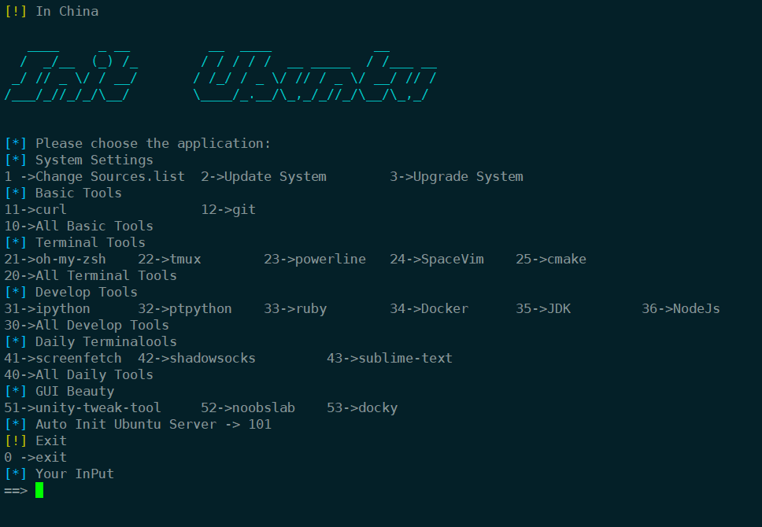
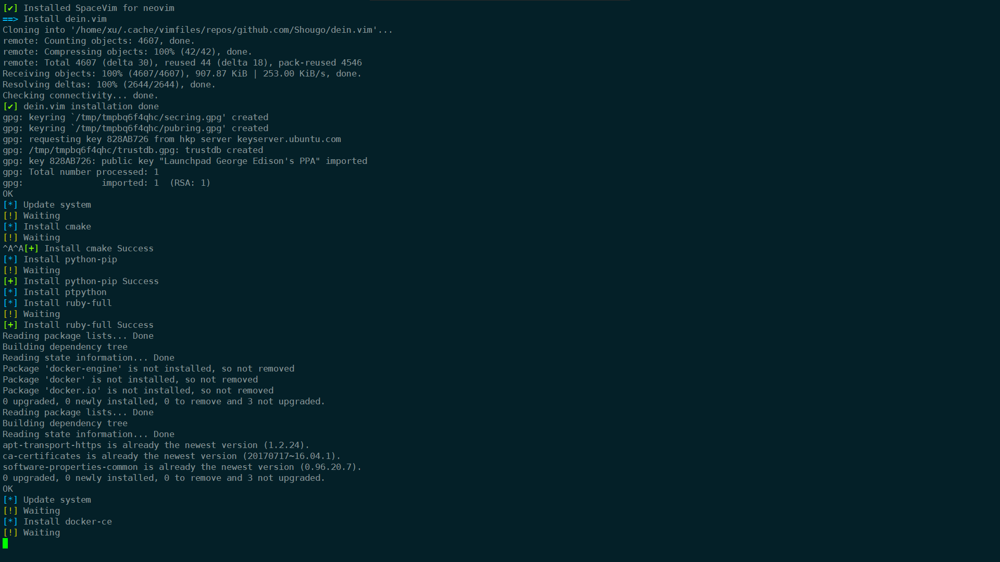
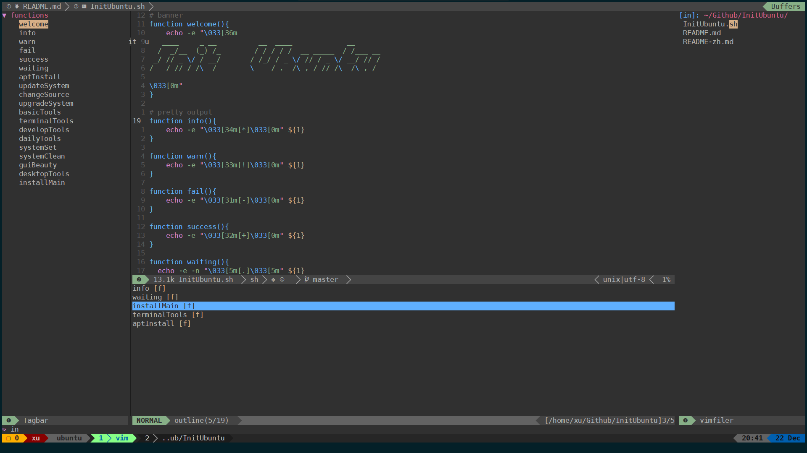
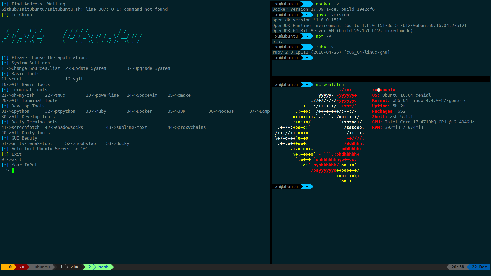

<h1 align="center">Init Ubuntu</h1>

- [中文文档](README-zh.md)

## Screenshot

### menu

### run

## Profile

- source

TODO

- terminal config
	- [tmux](https://gist.github.com/XuCcc/5e6b50e0d07f7c82b8f880e2ad59b6a9)
    - [zsh](https://gist.github.com/XuCcc/9859c4721ccc4949c8583d3202fc6483)

- vim
	- [SpaceVim](http://spacevim.org) 

## Result

### Terminal

### Gui

TODO
