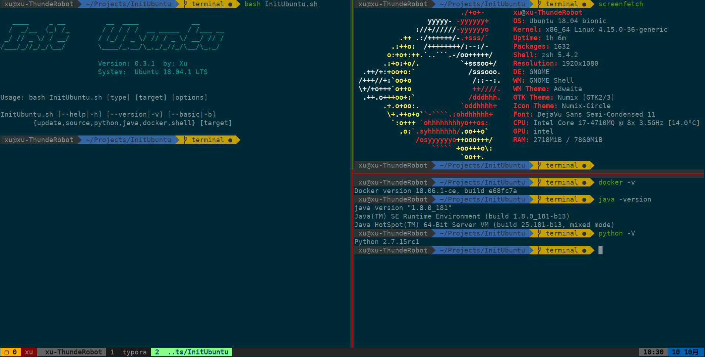

<h1 align="center">Init Ubuntu</h1>

[]()
[](https://github.com/XuCcc/InitUbuntu/releases/tag/0.1.0)
[]()



## Tools

Use `bash InitUbuntu.sh -h` to see support tools and help.

```bash
[update]
[source]
        apt:    http://mirrors.ustc.edu.cn/ubuntu/
        pip:    https://pypi.tuna.tsinghua.edu.cn/simple
        docker: https://docker.mirrors.ustc.edu.cn
[common]
        aira2: A lightweight multi-protocol & multi-source command-line download utility
        tldr: Simplified and community-driven man pages
[python]
        pip: pip3
        pyenv: Simple Python version management
        pipenv: Python Development Workflow for Humans
        ptpython: an advanced Python REPL
[java]
        jdk: Oracle JDK
        maven: A software project management and comprehension tool
[javascript]
        nvm: Node Version Manager - Simple bash script to manage multiple active node.js versions
[docker]
        docker-ce: 
        docker-compose: A tool for defining and running multi-container Docker applications
[terminal]
        zsh: a delightful, open source, community-driven framework for managing your Zsh configuration.
        Myzsh: custom ~/.zshrc
        zsh-syntax-highlighting: Fish shell like syntax highlighting for Zsh
        autojump: shell extension to jump to frequently used directories
        tmux: terminal multiplexer
        Mytmux: custom ~/.tmux.conf

```

You can find **zsh&&tmux** profiles in `./config`

## Requires

- `git&curl` You can install them easily by `bash InitUbuntu.sh --basic`
- **zsh** theme agnoster need [powerline fonts](https://github.com/powerline/fonts)


> Submit any other useful develop tools in the issue.