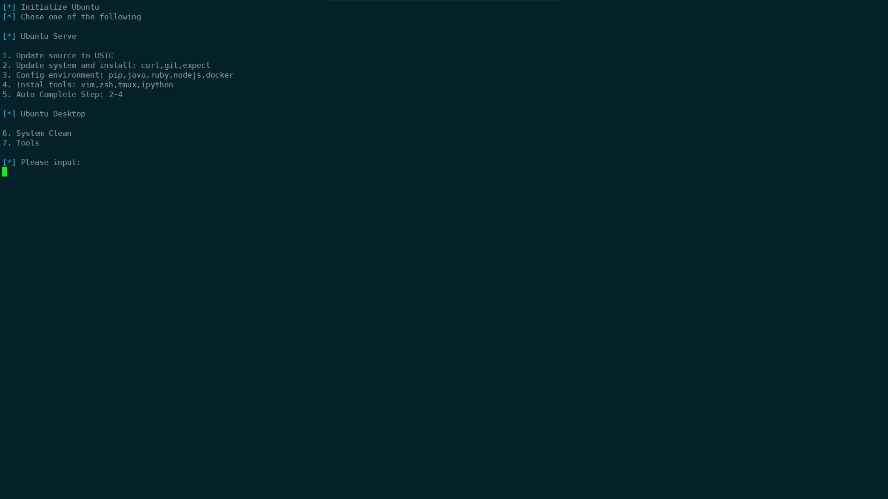
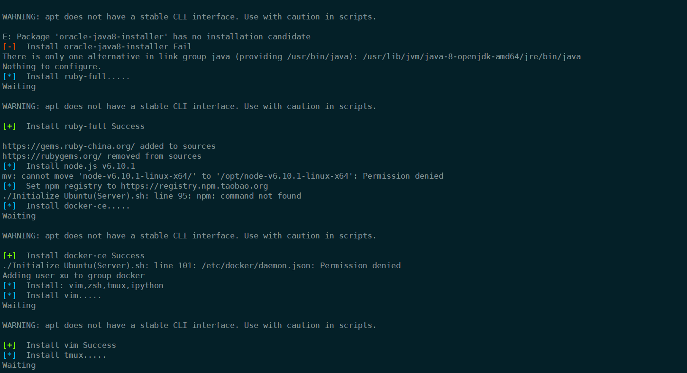
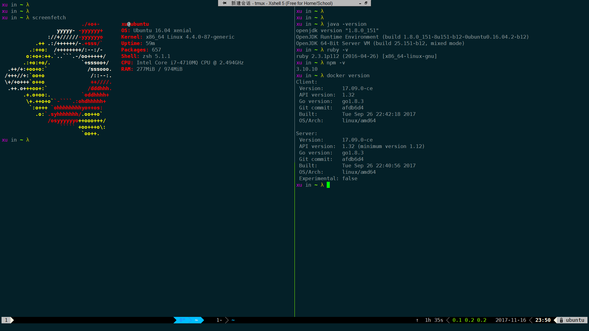
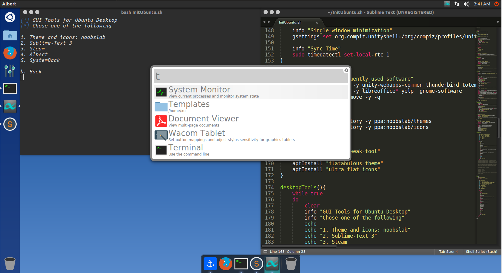

Init Ubuntu
===

## 截图

菜单



运行截图



## 配置文件

- source.list

可以自己切换为Aliyun的,感觉最近Aliyun update有点慢 = =

```sh
sudo sed -i 's/[a-zA-Z]*.archive.ubuntu.com/mirrors.ustc.edu.cn/g' /etc/apt/sources.list
# sudo sed -i 's/[a-zA-Z]*.archive.ubuntu.com/mirrors.aliyun.com/g' /etc/apt/sources.list
```

- tmux

集成了个人最常用的几个功能   

https://gist.github.com/XuCcc/2f3d5d05a39f10b871aa10095318ca22

- 各种源的替换,按需求取消对应注释即可

```sh
# pip
printf "[global]\nindex-url = https://pypi.tuna.tsinghua.edu.cn/simple\n" >> .pip/pip.conf

# npm
gem sources --add https://gems.ruby-china.org/ --remove https://rubygems.org

# docker
echo -e "{\n\t\"registry-mirrors\": [\"https://docker.mirrors.ustc.edu.cn\"]\n}\n" >> /etc/docker/daemon.json
```

## 最终效果

### 终端



### Desktop图形化

 

